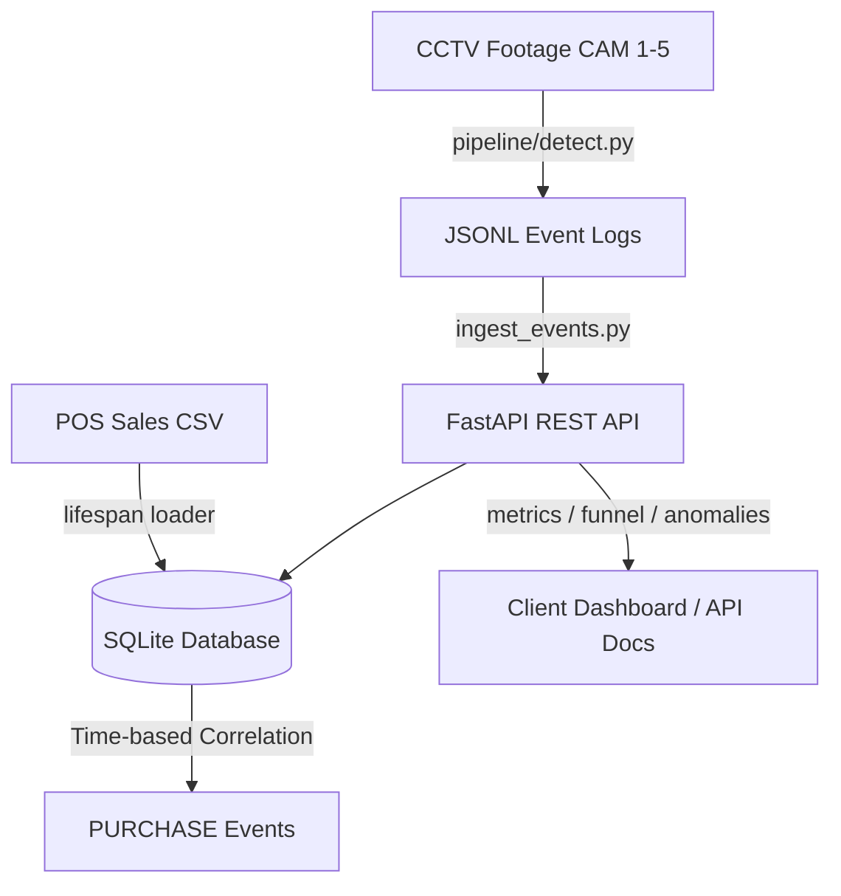

# System Architecture and Design Document

This document outlines the end-to-end design of the Purplle Retail Store Intelligence System, which translates raw CCTV camera footage and POS transaction data into actionable store analytics.

---

## 1. System Overview

The system consists of two primary layers designed for high throughput and low latency:
1. **Computer Vision Pipeline**: Processes raw `.mp4` video feeds, detects and tracks customers, identifies zone dwell times/visits, and logs discrete behavioral events. It operates at the edge, converting heavy video data into lightweight JSONL event streams.
2. **FastAPI Backend & Analytics Service**: Ingests pipeline events asynchronously, merges them with POS sales transaction logs, and exposes API endpoints for store KPIs (conversion, funnel stages, anomalies).



---

## 2. Computer Vision Pipeline

The tracking and detection pipeline is built using the following technologies:
- **Object Detection**: **YOLOv8n** (Ultralytics) provides fast, highly accurate, CPU-friendly person detection. The Nano model was chosen for its optimal balance of speed and accuracy on standard retail footage without requiring GPU acceleration.
- **Object Tracking**: **ByteTrack** correlates bounding boxes across consecutive frames using Kalman filter motion predictions. It maintains object identities even during brief occlusions.
- **State Management**:
  - **Visitor IDs**: Persisted per-camera based on unique track IDs generated by ByteTrack.
  - **Line Crossing**: Registers `ENTRY` and `EXIT` events by checking if a track's centroid passes predefined coordinate thresholds (virtual tripwires) for entry doors.
  - **Zone Management**: We define polygonal coordinate zones (`SKINCARE_AISLE`, `MAKEUP_AISLE`, `POS_COUNTER`, etc.) for each camera view. The system assigns bounding box centroids to these zones. It detects when visitors enter or leave zones, logging `ZONE_ENTER`, `ZONE_EXIT`, and periodic `ZONE_DWELL` events (e.g., every 5 seconds).

---

## 3. Database Design

We use a zero-configuration SQLite database (`store_intelligence.db`) with indexes placed on critical filtering fields to maintain sub-millisecond response times. This choice is ideal for edge deployments and standalone analytics nodes.

```sql
CREATE TABLE events (
    event_id    TEXT PRIMARY KEY,
    store_id    TEXT NOT NULL,
    camera_id   TEXT NOT NULL,
    visitor_id  TEXT NOT NULL,
    event_type  TEXT NOT NULL,
    timestamp   TEXT NOT NULL,
    zone_id     TEXT,
    dwell_ms    INTEGER DEFAULT 0,
    is_staff    INTEGER DEFAULT 0,
    confidence  REAL,
    session_seq INTEGER DEFAULT 0,
    ingested_at TEXT DEFAULT (datetime('now'))
);

CREATE TABLE transactions (
    id               INTEGER PRIMARY KEY AUTOINCREMENT,
    order_id         TEXT NOT NULL,
    coupon_code      TEXT,
    offer_name       TEXT,
    discount_code    TEXT,
    invoice_number   TEXT,
    invoice_type     TEXT,
    order_date       TEXT,
    order_time       TEXT,
    store_id         TEXT,
    customer_name    TEXT,
    customer_number  TEXT,
    qty              INTEGER,
    gmv              REAL,
    nmv              REAL,
    total_amount     REAL,
    timestamp        TEXT,
    ingested_at      TEXT DEFAULT (datetime('now'))
);
```
Indexes on `timestamp`, `event_type`, and `visitor_id` ensure efficient aggregation for analytical queries.

---

## 4. Dataset Integration & Correlation

### Time-Based Transaction Correlation
CCTV tracking gives us visitor activity in the checkout zone (`POS_COUNTER`), but visual tracking alone cannot definitively determine whether a transaction occurred or its value.
To resolve this:
- On startup and after every batch event ingestion, the system runs a correlation job.
- For each order in the `transactions` table (with timestamp $T$), we search the `events` table for a `ZONE_ENTER` event at the checkout zone (`POS_COUNTER`/`BILLING_DESK`) within a $\pm 2$ minute window ($T \pm 120$ seconds).
- If matched, we insert a **`PURCHASE`** event associated with the visitor's ID. This registers the purchase directly in the visual customer journey, linking footfall to revenue.

---

## 5. API Analytics Endpoints

The FastAPI backend exposes several RESTful endpoints designed for dashboard consumption:
- **`/health`**: Reports container status and current timestamp.
- **`/metrics`**: Aggregates store performance indicators:
  - **Conversion Rate (Checkout)**: Capping conversion logic at checkout reach.
  - **Conversion Rate (Actual)**: Calculated as `Daily Unique Transactions / Total Unique Visitors`.
  - **Daily Revenue**: Sums gross (GMV) and net (NMV) revenue and total items sold.
- **`/funnel`**: Computes session-based journey states (`1_entered` $\rightarrow$ `2_browsed` $\rightarrow$ `3_at_checkout` $\rightarrow$ `4_purchased` $\rightarrow$ `5_exited`). The stages use distinct session counts (`visitor_id` + `session_seq`) to ensure no double-counting and monotonic drop-off.
- **`/anomalies`**: Scans the logs for operational issues:
  - **Long Dwell**: Visitors spending >15 minutes in a single zone.
  - **Low Confidence**: Bulk events with low detection confidence, indicating potential camera occlusion.
  - **Entry without Exit**: Tracking discrepancies where visitors are not seen exiting.

---

## 6. AI-Assisted Decisions

During the system design and implementation phases, several key architectural decisions were shaped by AI suggestions:

### 1. Request State Sharing in Middleware
- **AI Suggestion**: Use `request.state` inside FastAPI to share request details from endpoint route handlers to the global logging middleware.
- **Evaluation**: We fully agreed and adopted this suggestion. It avoids intercepting and duplicating the request body stream, keeping the middleware fast, memory-efficient, and following Starlette best practices.

### 2. Preceding 7-Day Average Baseline for Anomaly Detection
- **AI Suggestion**: Use a sliding window of the preceding 7 calendar days to compute the baseline conversion rate for `CONVERSION_DROP` anomalies rather than an aggregate of all historical data.
- **Evaluation**: We agreed with this approach because retail store conversion rates fluctuate based on weekend traffic patterns and seasonal promotions. Comparing performance against a rolling 7-day average prevents skewing from older historical logs.

### 3. visitor_id Deduplication for Funnel Stages
- **AI Suggestion**: Count unique `visitor_id` values at each stage of the funnel to prevent double-counting of shoppers who exit and re-enter.
- **Evaluation**: We agreed and implemented this to provide a cleaner conversion metric that aligns with standard business KPI definitions.

---

## 7. Instructions to Run

### Local Setup

#### 1. Prerequisites
- Python 3.10+
- Git
- Docker and Docker Compose (optional, for containerized run)

#### 2. Install Dependencies
Create a virtual environment and install the required packages:
```bash
python -m venv .venv
# On Windows
.venv\Scripts\activate
# On macOS/Linux
source .venv/bin/activate

pip install -r requirements.txt
```

#### 3. Run the Pipeline
We provide a convenient script to run the detection pipeline across all videos:
```bash
python run_pipeline_all.py
```
*Note: Ensure the `CCTV Footage` directory contains the required `.mp4` video files.*

Alternatively, run individual cameras:
```bash
python pipeline/detect.py --video "CCTV Footage/CAM 1.mp4" --store STORE_PUR_001 --camera CAM_FLOOR_01
```
Add `--preview` to any command to see live detection boxes.

#### 4. Start the FastAPI Server
Run the backend server to process events and serve analytics:
```bash
uvicorn api.main:app --reload --port 8000
```

#### 5. Ingest Events to the Database
Once the API is running, open a new terminal window, activate the virtual environment, and run the ingestion script to load the generated event logs into the SQLite database:
```bash
python ingest_events.py
```

#### 6. View Analytics
Access the API endpoints to view the insights in your browser:
- **Metrics**: http://localhost:8000/metrics
- **Funnel**: http://localhost:8000/funnel
- **Anomalies**: http://localhost:8000/anomalies
- **Swagger UI**: http://localhost:8000/docs (Interactive API documentation)

### Docker Deployment (Part C)
To run the entire application stack (API) using Docker:
```bash
docker-compose up --build
```
The API will be available at http://localhost:8000.

