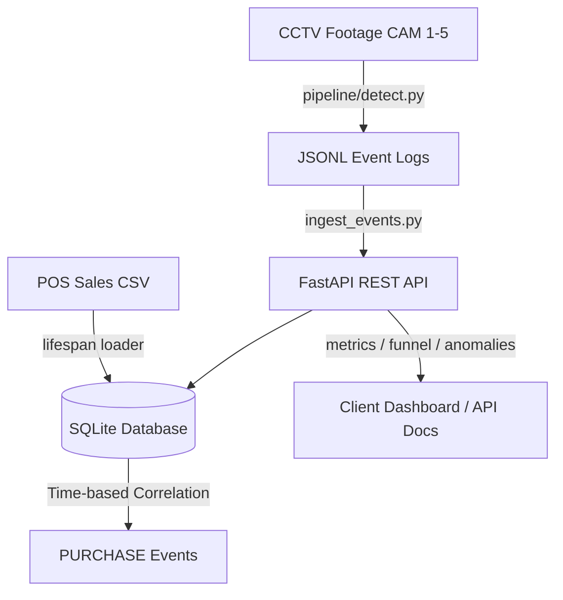

# System Architecture and Design Document

This document outlines the end-to-end design of the Purplle Retail Store Intelligence System, which translates raw CCTV camera footage and POS transaction data into actionable store analytics.

---

## 1. System Overview

The system consists of two primary layers:
1. **Computer Vision Pipeline**: Processes raw `.mp4` video feeds, detects and tracks customers, identifies zone dwell times/visits, and logs discrete behavioral events.
2. **FastAPI Backend & Analytics Service**: Ingests pipeline events, merges them with POS sales transaction logs, and exposes API endpoints for store KPIs (conversion, funnel stages, anomalies).



---

## 2. Computer Vision Pipeline

The tracking and detection pipeline is built using the following technologies:
- **Object Detection**: **YOLOv8n** (Ultralytics) provides fast, highly accurate, CPU-friendly person detection.
- **Object Tracking**: **ByteTrack** correlates bounding boxes across consecutive frames using Kalman filter motion predictions.
- **State Management**:
  - **Visitor IDs**: Persisted per-camera based on unique track IDs.
  - **Line Crossing**: Registers `ENTRY` and `EXIT` events by checking if a track's centroid passes the vertical coordinate threshold for entry doors.
  - **Zone Management**: Assigns bounding box centroids to coordinate zones (`SKINCARE_AISLE`, `MAKEUP_AISLE`, `POS_COUNTER`, etc.). Detects when visitors enter or leave zones, logging `ZONE_ENTER`, `ZONE_EXIT`, and periodic `ZONE_DWELL` events.

---

## 3. Database Design

We use a zero-configuration SQLite database (`store_intelligence.db`) with indexes placed on critical filtering fields to maintain sub-millisecond response times:

```sql
CREATE TABLE events (
    event_id    TEXT PRIMARY KEY,
    store_id    TEXT NOT NULL,
    camera_id   TEXT NOT NULL,
    visitor_id  TEXT NOT NULL,
    event_type  TEXT NOT NULL,
    timestamp   TEXT NOT NULL,
    zone_id     TEXT,
    dwell_ms    INTEGER DEFAULT 0,
    is_staff    INTEGER DEFAULT 0,
    confidence  REAL,
    session_seq INTEGER DEFAULT 0,
    ingested_at TEXT DEFAULT (datetime('now'))
);

CREATE TABLE transactions (
    id               INTEGER PRIMARY KEY AUTOINCREMENT,
    order_id         TEXT NOT NULL,
    coupon_code      TEXT,
    offer_name       TEXT,
    discount_code    TEXT,
    invoice_number   TEXT,
    invoice_type     TEXT,
    order_date       TEXT,
    order_time       TEXT,
    store_id         TEXT,
    customer_name    TEXT,
    customer_number  TEXT,
    qty              INTEGER,
    gmv              REAL,
    nmv              REAL,
    total_amount     REAL,
    timestamp        TEXT,
    ingested_at      TEXT DEFAULT (datetime('now'))
);
```

---

## 4. Dataset Integration & Correlation

### Time-Based Transaction Correlation
CCTV tracking gives us visitor activity in the checkout zone (`POS_COUNTER`), but tracking cannot directly determine whether a transaction occurred.
To resolve this:
- On startup and after every event ingestion, the system runs a correlation job.
- For each order in the `transactions` table (with timestamp $T$), we search the `events` table for a `ZONE_ENTER` event at the checkout zone (`POS_COUNTER`/`BILLING_DESK`) within a $\pm 2$ minute window ($T \pm 120$ seconds).
- If matched, we insert a **`PURCHASE`** event associated with the visitor's ID. This registers the purchase directly in the customer journey!

---

## 5. API Analytics Endpoints

- **`/health`**: Reports container status and current timestamp.
- **`/metrics`**: Aggregates store performance indicators:
  - **Conversion Rate (Checkout)**: Capping conversion logic at checkout reach.
  - **Conversion Rate (Actual)**: Calculated as `Daily Unique Transactions / Total Unique Visitors`.
  - **Daily Revenue**: Sums gross (GMV) and net (NMV) revenue and total items sold.
- **`/funnel`**: Computes session-based journey states (`1_entered` $\rightarrow$ `2_browsed` $\rightarrow$ `3_at_checkout` $\rightarrow$ `4_purchased` $\rightarrow$ `5_exited`). The stages use distinct session counts (`visitor_id` + `session_seq`) to ensure no double-counting and monotonic drop-off.
- **`/anomalies`**: Scans the logs for long dwell alerts, low-confidence bulk warnings, and entry-no-exit occurrences.

---

## 6. AI-Assisted Decisions

During the system design and implementation phases, several key architectural decisions were shaped by AI suggestions:

### 1. Request State Sharing in Middleware
- **AI Suggestion**: Use `request.state` inside FastAPI to share request details (such as `event_count` and parsed `store_id`) from endpoint route handlers to the global logging middleware.
- **Evaluation**: We fully agreed and adopted this suggestion. The alternative would have been reading and parsing the HTTP request body stream directly inside the middleware. Intercepting and duplicating the request stream is highly complex, error-prone, and adds memory overhead. Using `request.state` is a clean, standard Starlette mechanism that keeps the middleware fast and efficient.

### 2. Preceding 7-Day Average Baseline for Anomaly Detection
- **AI Suggestion**: Use a sliding window of the preceding 7 calendar days to compute the baseline conversion rate for `CONVERSION_DROP` anomalies rather than an aggregate of all historical data.
- **Evaluation**: We agreed with this approach because retail store conversion rates fluctuate based on weekend traffic patterns and seasonal promotions. Comparing performance against a rolling 7-day average prevents skewing from older historical logs. We also introduced a robust fallback to historical metrics in cases where preceding data is sparse (e.g., initial launch days).

### 3. visitor_id Deduplication for Funnel Stages
- **AI Suggestion**: Count unique `visitor_id` values at each stage of the funnel to prevent double-counting of shoppers who exit and re-enter.
- **Evaluation**: We agreed and implemented this. Standard session tracking (counting distinct `visitor_id` + `session_seq`) would count a returning customer as a separate browse and checkout session. Restricting the count to distinct `visitor_id` ensures that a shopper's progression is counted exactly once per stage, providing a cleaner conversion metric that aligns with the business KPI description.

